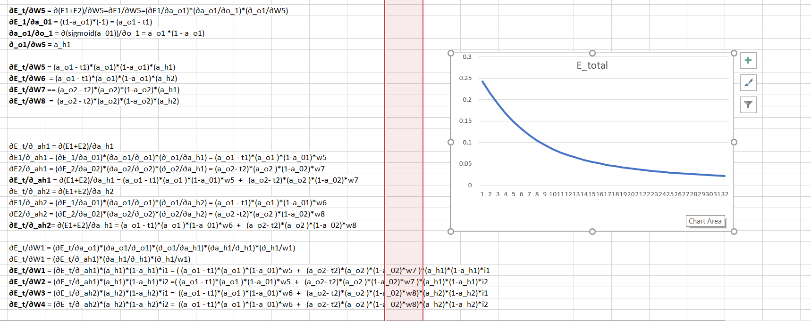
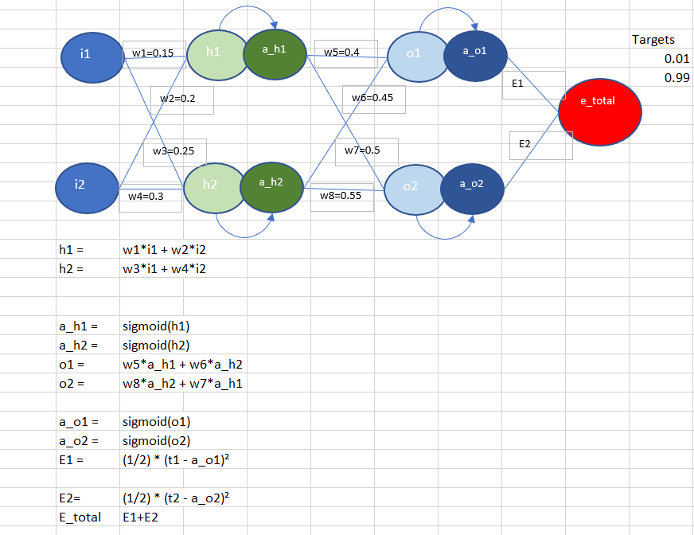
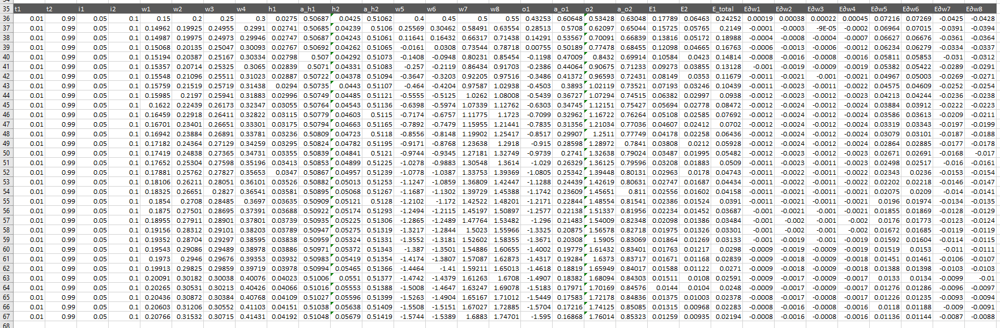
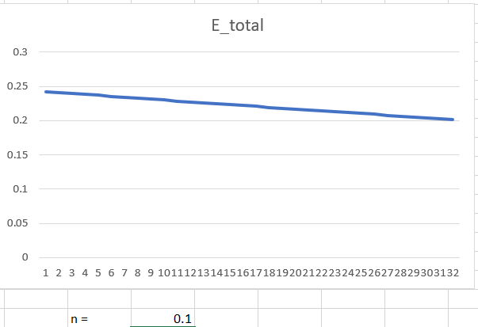
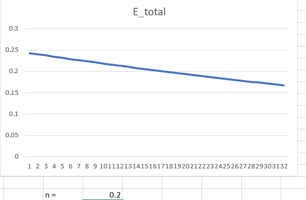
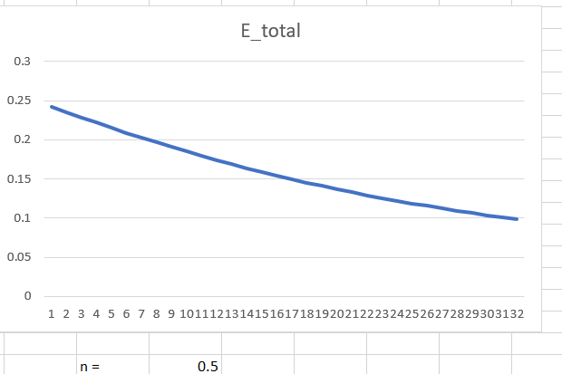
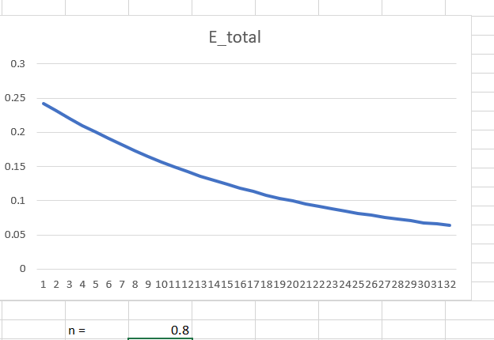
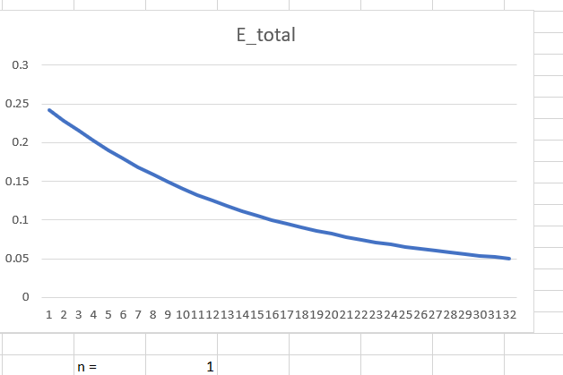
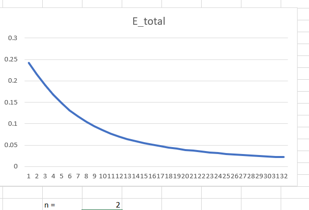

*Deep Learning in Excel*

**Equations and Loss Curve**

**I - Forward Prop**

1. Set targets t1 and t2 which are the values the NN is supposed to get closest to.

2. Set i1 and i2 to be two numbers which should be taken in by the networks. 

3. Initialize all weights all weights (generally with a pattern, though with predetermined values here

4. Calcuate h1 as an affine function with W1,W2 and as parameters and i1 and i2 as inputs. Pass it through a sigmoid to get a_h1	

5. Calculate h2 similarly but W3 and W4 as parameters and then calulate a_h2

6. Repeat similar steps in 4 and 5 for the next layer

7. Find the aggregated error 

**II - Backprop**

1. Find the partial derivatives of W5 wrt the error value 
2. Make slight changes to the W5 equation by tracking the weight connections
to find W6,W7 and W8. 
3. Find partial derivatives of the activations functions wrt the error 
4. Find weights W1 and W4 using these intermediate gradients and the chain rule 
5. Use a LR and fix a loop to update the weights 
6. Use the magic of excel  to train the network for as many epochs as needed ;)

**III - Error Graphs at different learning rates**

LR = 0.1

LR = 0.2

LR = 0.5

LR = 0.8

LR = 1

LR = 2

